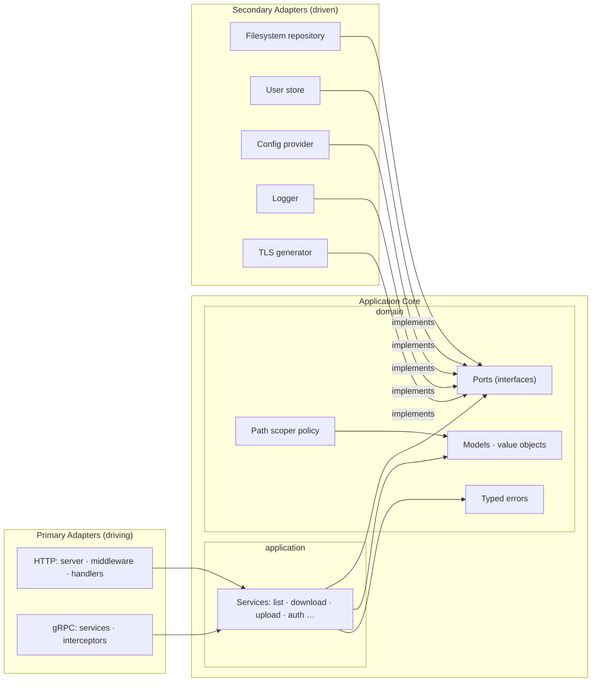
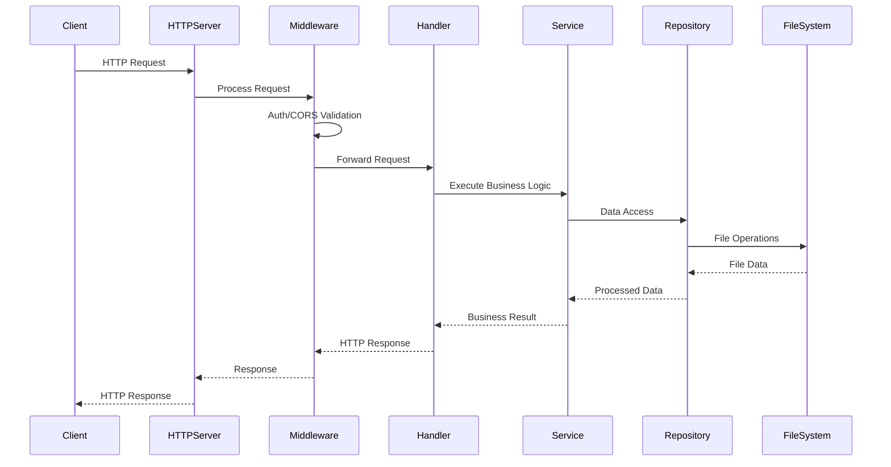
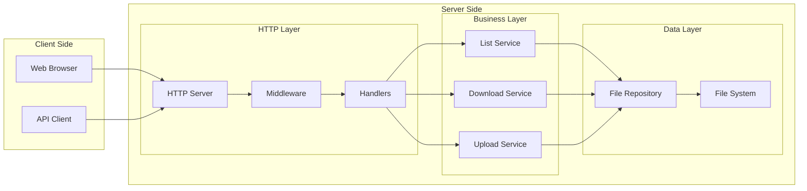

# Simple File Share


A high-performance, secure file sharing application built with Go and React, structured as a hexagonal (ports & adapters) application.

## 🌟 Overview

Simple File Share is a modern web application that provides secure file management capabilities with a clean, intuitive interface. Its backend follows hexagonal architecture: a framework-free domain and application core surrounded by swappable primary adapters (HTTP, gRPC) and secondary adapters (filesystem, auth, config, logging), so storage backends and transports can be replaced independently.

## 🎯 Key Features

### 🛡️ Security First
- **End-to-End HTTPS**: All communications can be encrypted using TLS 1.3
- **Path Traversal Protection**: Built-in safeguards against directory traversal attacks
- **Multi-User Accounts**: Every request is authenticated and scoped to the signed-in user
- **Hashed Passwords**: PBKDF2-SHA256 (600k iterations, per-user salt) — no plaintext credentials
- **Input Validation**: Comprehensive validation for all user inputs
- **CORS Protection**: Configurable CORS policies for web security

### 🚀 Performance Optimized
- **Efficient File Handling**: Stream-based processing for minimal memory usage
- **Concurrent Operations**: Handles multiple file operations efficiently
- **ZIP Streaming**: On-the-fly ZIP creation for folder downloads without temporary files
- **Optimized Timeouts**: Reasonable server timeouts for better resource management

### 📁 Advanced File Operations
- **Directory Browsing**: Clean HTML interface with file details
- **Bulk Operations**: Upload/download multiple files or entire folders
- **Live Upload Progress**: Byte-level progress and transfer rate (KB/s–GB/s) via XHR upload events, aggregated across multi-file batches, with a collapsible floating indicator and cancel + confirmation
- **Broad Format Support**: Documents, images, archives and disk images (incl. `.iso`), video, and audio — matched by MIME type or extension
- **On-Demand Zipping**: Download folders as ZIP archives with a single click
- **File Metadata**: View file sizes, modification dates, and types

### 🖼️ In-App Viewer & Editor
- **File Preview**: Render PDFs, images, audio, and video inline without leaving the page
- **Markdown Editor**: Preview and edit `.md` files with a built-in editor
- **Safe Streaming**: Non-renderable or unsafe types (e.g. HTML/SVG) are force-downloaded

### 🌐 Internationalization
- **Bilingual UI**: English and Arabic with full RTL support
- **Persisted Preference**: Language choice is stored in the browser
- **Auto-detection**: Defaults to Arabic when the browser language is Arabic

### 👥 Multi-User & Permissions
- **Self-Service Signup**: Optional public registration (`ENABLE_SIGNUP`); the first account becomes an admin
- **Private Storage**: Each regular user sees only their isolated home directory; requests for another user's namespace return `403`
- **Global Shared Folder**: A common `shared/` space that every signed-in user can read (writes are admin-only)
- **Admin Console**: Admins see every account with per-user file count and storage usage
- **Bootstrap Admin**: An admin is seeded from `ADMIN_USERNAME`/`ADMIN_PASSWORD` on first run, so existing deployments keep working

### 🏗️ Hexagonal Architecture
- **Ports & Adapters**: A pure `domain` + `application` core with no framework imports; adapters depend inward, never the reverse
- **Primary Adapters**: HTTP (`net/http`) and gRPC expose the same application services
- **Secondary Adapters**: Filesystem repository, user store, config, TLS, and logging are all swappable behind domain ports
- **Dependency Injection**: Adapters are wired once in `cmd/server/main.go`, keeping the core easy to test
- **Pluggable Storage**: Implement the repository port to swap the local filesystem for S3 or another backend
- **Structured Logging**: Built-in structured logging for monitoring and debugging

## 🛠️ Technology Stack

### Backend
- **Language**: Go 1.25+
- **Transports**: Standard Library `net/http` (web) and gRPC (`google.golang.org/grpc`) for mobile clients
- **Authentication**: HTTP Basic Auth against a JSON-backed user store with PBKDF2-SHA256 password hashing
- **TLS**: Built-in support with automatic certificate management
- **Serving**: Serves the API and the built React frontend from a single container
- **Testing**: Native Go testing with table-driven tests
- **Documentation**: OpenAPI 3.0 (Swagger) specification and a protobuf gRPC contract

### Frontend
- **Framework**: React 19+ with TypeScript
- **Build Tool**: Vite
- **Styling**: Tailwind CSS with responsive design
- **State Management**: Zustand (global stores) with selectors
- **Internationalization**: English/Arabic with RTL layout and persisted preference

## 📚 API Documentation

### Endpoints

#### 1. List Directory
```
GET /api/files?path=<dir>
```
- **Parameters**:
  - `path` (query, optional): Directory path to list (defaults to the user's root)
- **Responses**:
  - `200`: JSON array of `{ name, path, size, isDir, modified, mimeType }`
  - `401`: Authentication required
  - `403`: Forbidden (path traversal or another user's private space)
  - `404`: Path not found
  - `409`: Path is not a directory

#### 2. Upload Files
```
POST /api/upload
Content-Type: multipart/form-data
```
- **Parameters**:
  - `file` (form-data): One or more files to upload
  - `path` (form-data, optional): Target directory
- **Responses**:
  - `201`: JSON array of uploaded `{ path, size }` objects
  - `400`: Invalid request
  - `401`: Authentication required
  - `403`: Forbidden (read-only shared folder or another user's space)
  - `413`: Payload too large

#### 3. Download File or Folder
```
GET /api/files/download?path=<path>
```
- Streams the file, or builds a ZIP archive on the fly when `path` points at a directory. The choice is based on the target's actual type, so a regular file named `*.zip` downloads as-is.
- **Responses**:
  - `200`: File or ZIP stream
  - `400`: Invalid path
  - `401`: Authentication required
  - `403`: Forbidden
  - `404`: Path not found

#### 4. View File Inline
```
GET /api/files/view?path=<file>
```
- Streams a file with `Content-Disposition: inline` so the browser renders it.
- Only safe types (PDF, images, audio/video, plain text/markdown) are inline;
  anything else is forced to download to prevent script injection.
- **Responses**:
  - `200`: File contents
  - `400`: Invalid path
  - `401`: Authentication required
  - `404`: Path not found
  - `409`: Path is a directory

#### 5. File Info
```
GET /api/files/info?path=<path>
```
- **Responses**:
  - `200`: `{ name, path, size, isDir, modified, mimeType }`
  - `401`: Authentication required
  - `404`: Path not found

#### 6. Search Files
```
GET /api/files/search?q=<query>&limit=<n>
```
- Recursively matches names/paths and full-text content within the caller's visible scope (pure-Go inverted index over text file contents; binaries skipped).
- **Responses**:
  - `200`: JSON array of matching file entries
  - `400`: Missing query
  - `401`: Authentication required

#### 7. Update File Content
```
PUT /api/files/content
Content-Type: application/json
```
- **Body**:
  ```json
  { "path": "notes.md", "content": "# New content" }
  ```
- Overwrites a plain-text file (used by the markdown editor).
- **Responses**:
  - `200`: `{ "message": "file updated", "size": 21 }`
  - `400`: Invalid request or unknown content type
  - `401`: Authentication required
  - `404`: Path not found

#### 8. Create Directory
```
POST /api/directories
Content-Type: application/json
```
- **Body**: `{ "path": "reports/2026" }`
- **Responses**:
  - `201`: `{ "message": "directory created", "path": "reports/2026" }`
  - `400`: Invalid path
  - `401`: Authentication required
  - `403`: Forbidden (read-only shared folder)
  - `409`: Path already exists

#### 9. Delete File or Folder
```
DELETE /api/files
Content-Type: application/json
```
- **Body**: `{ "path": "old.txt" }`
- **Responses**:
  - `200`: `{ "message": "deleted", "path": "old.txt" }`
  - `400`: Invalid path
  - `401`: Authentication required
  - `403`: Forbidden (read-only shared folder)
  - `404`: Path not found

#### 10. Health Check
```
GET /health
```
- **Responses**:
  - `200`: Service is healthy
  ```json
  {
    "status": "healthy"
  }
  ```

#### 11. Register Account
```
POST /api/auth/register
Content-Type: application/json
```
- **Body**: `{ "username": "alice", "password": "s3cret" }`
- Public endpoint; only available when `ENABLE_SIGNUP` is true. The first account created becomes an admin.
- **Responses**:
  - `201`: `{ "username": "alice", "isAdmin": false, "createdAt": "..." }`
  - `400`: Invalid username or password
  - `403`: Registration disabled
  - `409`: Username already exists

#### 12. Auth Capabilities
```
GET /api/auth/info
```
- Public endpoint reporting runtime auth features.
- **Responses**:
  - `200`: `{ "signupEnabled": true }`

#### 13. Current User
```
GET /api/auth/me
```
- Returns the authenticated account (or the system-admin view when auth is disabled).
- **Responses**:
  - `200`: `{ "username": "alice", "isAdmin": false, "createdAt": "..." }`
  - `401`: Authentication required

#### 14. List Users (admin only)
```
GET /api/admin/users
```
- **Responses**:
  - `200`: Array of `{ "username", "isAdmin", "createdAt", "files", "size" }`
  - `401`: Authentication required
  - `403`: Admin access required

#### 15. API Documentation
```
GET /swagger       # Swagger UI
GET /swagger.yaml  # OpenAPI 3.0 spec
```
- **Responses**:
  - `200`: Swagger UI interface or the raw OpenAPI document

### gRPC API (mobile)

The same use cases are exposed over gRPC for native mobile clients. The proto
contract lives at `backend/api/proto/fileshare/v1/fileshare.proto`; generated
Go stubs live beside it.

- **Services**
  - `fileshare.v1.AuthService`: `Register`, `Authenticate`, `Me`, `GetAuthInfo`, `ListUsers` (admin)
  - `fileshare.v1.FileService`: `ListFiles`, `GetFileInfo`, `SearchFiles`, `CreateDirectory`, `DeletePath`, `UpdateFileContent`, `UploadFile` (client streaming), `DownloadFile` (server streaming)
- **Authentication**: HTTP Basic credentials in request metadata (`authorization: Basic ...`), matching the web API. `Register`, `Authenticate`, and `GetAuthInfo` are public.
- **Streaming**: uploads send a metadata message followed by `chunk` messages; downloads stream 64 KiB `DownloadChunk` messages, with the resolved filename/content type on the first chunk.
- **Server**: health (`grpc.health.v1.Health`) and server reflection are enabled for tooling.
- **Configuration**: `ENABLE_GRPC` (default `true`) and `GRPC_PORT` (default `50051`). TLS is reused from `ENABLE_TLS`.

```bash
# Inspect the schema (server reflection) with grpcurl
grpcurl -plaintext localhost:50051 list fileshare.v1.FileService
```

## 🏗️ Architecture

### Hexagonal (Ports & Adapters) Layers

Dependencies always point **inward**: adapters know the core, the core knows
only its own ports and models. The `domain` layer imports nothing from
`application` or `infrastructure`.


```mermaid
graph LR
    subgraph PRIMARY["Primary Adapters (driving)"]
        HTTP["HTTP: server · middleware · handlers"]
        GRPC["gRPC: services · interceptors"]
    end

    subgraph CORE["Application Core"]
        subgraph APP["application"]
            SVC["Services: list · download · upload · auth …"]
        end
        subgraph DOMAIN["domain"]
            PORTS["Ports (interfaces)"]
            MODELS["Models · value objects"]
            POLICY["Path scoper policy"]
            ERRORS["Typed errors"]
        end
    end

    subgraph SECONDARY["Secondary Adapters (driven)"]
        FS["Filesystem repository"]
        USERS["User store"]
        CONFIG["Config provider"]
        LOG["Logger"]
        TLS["TLS generator"]
    end

    HTTP --> SVC
    GRPC --> SVC
    SVC --> PORTS
    SVC --> MODELS
    POLICY --> MODELS
    SVC --> ERRORS
    FS -->|implements| PORTS
    USERS -->|implements| PORTS
    CONFIG -->|implements| PORTS
    LOG -->|implements| PORTS
    TLS -->|implements| PORTS
```

### Request Flow


```mermaid
sequenceDiagram
    participant Client
    participant HTTPServer
    participant Middleware
    participant Handler
    participant Service
    participant Repository
    participant FileSystem
    
    Client->>HTTPServer: HTTP Request
    HTTPServer->>Middleware: Process Request
    Middleware->>Middleware: Auth/CORS Validation
    Middleware->>Handler: Forward Request
    Handler->>Service: Execute Business Logic
    Service->>Repository: Data Access
    Repository->>FileSystem: File Operations
    FileSystem-->>Repository: File Data
    Repository-->>Service: Processed Data
    Service-->>Handler: Business Result
    Handler-->>Middleware: HTTP Response
    Middleware-->>HTTPServer: Response
    HTTPServer-->>Client: HTTP Response
```

### Component Interaction


```mermaid
graph LR
    subgraph "Client Side"
        WEB[Web Browser]
        API[API Client]
    end
    
    subgraph "Server Side"
        subgraph "HTTP Layer"
            SERVER[HTTP Server]
            MW[Middleware]
            HANDLER[Handlers]
        end
        
        subgraph "Business Layer"
            LIST[List Service]
            DOWNLOAD[Download Service]
            UPLOAD[Upload Service]
        end
        
        subgraph "Data Layer"
            REPO[File Repository]
            FS[File System]
        end
    end
    
    WEB --> SERVER
    API --> SERVER
    SERVER --> MW
    MW --> HANDLER
    HANDLER --> LIST
    HANDLER --> DOWNLOAD
    HANDLER --> UPLOAD
    LIST --> REPO
    DOWNLOAD --> REPO
    UPLOAD --> REPO
    REPO --> FS
```

### Project Structure

```
.
├── backend/
│   ├── api/                          # Embedded assets
│   │   ├── embed.go                  # Embeds swagger.yaml into the binary
│   │   ├── swagger.yaml              # OpenAPI 3.0 specification
│   │   └── proto/fileshare/v1/       # gRPC contract + generated Go stubs
│   ├── application/services/         # Use-case orchestration (depends on ports only)
│   ├── cmd/server/                   # Composition root: wires adapters, starts HTTP + gRPC
│   ├── domain/                       # Framework-free core
│   │   ├── errors/                   # Typed domain errors
│   │   ├── models/                   # Entities and value objects
│   │   ├── policy/                   # Path scoping / permission rules
│   │   ├── ports/                    # Interfaces implemented by adapters
│   │   └── valueobjects/
│   └── infrastructure/
│       └── adapters/
│           ├── primary/              # Driving adapters: http/, grpc/, authctx/
│           └── secondary/            # Driven adapters: fs/, auth/, config/, tls/, logging/, memory/
├── frontend/                         # React + TypeScript + Vite SPA (see frontend/README.md)
├── scripts/
│   └── deploy-pages.sh               # Build + publish the frontend to GitHub Pages
├── .github/workflows/
│   ├── ci.yml                        # CI checks + GitHub Pages deploy (prod, PR previews, gh-pages branch)
│   └── release.yml                   # Container image release
├── dockerfile                        # Multi-stage build (frontend → Go → distroless-ish runtime)
├── docker-compose.yml
└── Makefile                          # Dev targets: run (backend), dev (frontend + backend)
```

## 🚀 Getting Started

### Prerequisites
- Go 1.25 or later
- Node.js 20+ (for frontend development)
- Docker (optional, for containerized deployment)

### Backend Setup

1. **Clone the repository**
   ```bash
   git clone https://github.com/EslamYasser-Dev/simple-file-share.git
   cd simple-file-share/backend
   ```

2. **Install dependencies**
   ```bash
   go mod download
   ```

3. **Configure environment variables**
   ```bash
   export ROOT_DIR=/path/to/storage      # dedicated storage dir (or FILE_SHARE_ROOT)
   export ADMIN_USERNAME=admin           # bootstrap admin (first run only)
   export ADMIN_PASSWORD=securepassword
   export PORT=22010
   export ENABLE_SIGNUP=true             # allow self-service registration
   export APP_ENV=development            # defaults to auth + TLS disabled
   export ENABLE_AUTH=false
   export ENABLE_TLS=false
   ```

   If `ROOT_DIR` is unset in development the server uses a dedicated
   `.file-share-data/` directory next to the working directory. It never falls
   back to the working directory, `frontend/`, or the home directory, and it
   rejects unsafe paths at startup.

4. **Run the server**
   ```bash
   go run cmd/server/main.go
   ```

### Frontend Setup

1. **Navigate to frontend directory**
   ```bash
   cd ../frontend
   ```

2. **Install dependencies**
   ```bash
   npm install
   ```

3. **Start development server**
   ```bash
   npm run dev
   ```

### Docker Setup

1. **Build and run with Docker Compose**
   ```bash
   docker-compose up --build
   ```

## ☁️ Deployment

Two deployment shapes are supported:

- **All-in-one** — a single self-contained Docker image serves both the React frontend and the Go API, so any Docker-capable host (Fly.io, Koyeb, Hugging Face Spaces, a VPS…) can run it with one container (Option B/C).
- **Split** — publish the static UI to **GitHub Pages** and host the Go API separately (Option A). GitHub Pages cannot run the Go backend (uploads, auth, storage), so the two must be wired together via `VITE_API_URL`.

### Environment variables

| Variable | Default | Description |
| --- | --- | --- |
| `APP_ENV` | `development` | `production` enables auth; `ENABLE_AUTH`/`ENABLE_TLS` also gate features |
| `PORT` | `22010` (dev `3000`) | HTTP listen port |
| `ROOT_DIR` / `FILE_SHARE_ROOT` | `.file-share-data` (dev) / `/data` (prod) | Dedicated storage directory owned by the server. Created with owner-only permissions (`0700`); unsafe values (filesystem root, working directory, home, source tree, or symlink) are rejected at startup |
| `STATIC_DIR` | `frontend/dist` | Directory containing the built React app (index.html + assets) |
| `ADMIN_USERNAME` / `FILE_SHARE_USERNAME` | `admin` | Bootstrap admin username, seeded only when no accounts exist |
| `ADMIN_PASSWORD` / `FILE_SHARE_PASSWORD` | `admin` | Bootstrap admin password (**change in production**) |
| `ENABLE_SIGNUP` | `true` | Allow public self-service registration |
| `MAX_UPLOAD_BYTES` | `unlimited` | Maximum upload size. `unlimited`/`0` (default) caps nothing; set e.g. `2GB`, `500MB`, or a raw byte count to enforce a limit |
| `ENABLE_AUTH` | `true` (prod) / `false` (dev) | Toggle Basic Auth |
| `ENABLE_TLS` | `false` | Serve HTTPS with generated certs |
| `ENABLE_GRPC` | `true` | Toggle the gRPC server for mobile clients |
| `GRPC_PORT` | `50051` | gRPC listen port |

> **Note:** `ADMIN_USERNAME`/`ADMIN_PASSWORD` are preferred over the legacy `USERNAME`/`PASSWORD` names. `USERNAME` is read from the process environment, and on machines where the OS/shell sets a `USERNAME` variable you may get your login name instead — prefer `ADMIN_USERNAME`.

### Option A — GitHub Pages (frontend) + hosted API

GitHub Pages serves the static React build; the Go API still runs on a Docker
host (Option B/C). Cross-origin requests already work because the server sends
permissive CORS headers.

**1. Deploy the API** using Option B/C below, then note its public origin
(e.g. `https://api.example.com`).

**2. Publish the UI** — automatically via CI, or manually with the deploy script:

- **CI (recommended):** in **Settings → Pages** set the source to
  **GitHub Actions**, then in **Settings → Secrets and variables → Actions →
  Variables** add `VITE_API_URL` = your API origin. Optionally add
  `VITE_BASE_PATH` (`/` for `<user>.github.io` user/org pages; it defaults to
  `/<repo>/` for project pages). The `ci.yml` workflow builds the frontend once
  and on every push to `master`/`main`/`enhancements`:
  - deploys it to GitHub Pages (Actions source),
  - force-pushes it to the `gh-pages` branch as a legacy fallback,
  - deploys each pull request to a Pages **preview** (same-repo PRs),
  - and verifies it in the Docker image build.
  
  For a production deploy a missing `VITE_API_URL` fails the workflow with a
  pointer to the repository variable (previews build fine without it).

- **Script:**
  ```bash
  VITE_API_URL=https://api.example.com ./scripts/deploy-pages.sh
  ```
  The script runs `npm ci && npm run build`, adds the SPA `404.html` fallback
  and `.nojekyll`, and force-pushes the result to the `gh-pages` branch. Then
  set **Settings → Pages → Source: Deploy from a branch → `gh-pages` / root**.

> **Auth note:** the UI signs in with HTTP Basic Auth against the API. Serve the
> API over HTTPS so credentials are never sent in the clear.

### Option B — Any Docker host

```bash
# Build the image (frontend + backend)
docker build -t simple-file-share .

# Run it (named volume inherits the image's /data ownership)
docker run -d --name file-share \
  -p 22010:22010 \
  -v file-share-data:/data \
  -e APP_ENV=production \
  -e ADMIN_USERNAME=admin \
  -e ADMIN_PASSWORD='your-strong-password' \
  simple-file-share

# Or, ready to go
docker-compose up --build
```

Then open `http://localhost:22010`.

> **Bind mounts:** if you prefer `-v "$PWD/data:/data"`, the server runs as
> `nobody` (uid/gid 65534) and must own `/data` to lock it to `0700`. Create the
> directory and give it to that user first:
> `mkdir -p data && sudo chown 65534:65534 data`.

### Option C — Pull the published image

Tagging a release (`git tag v1.0.0 && git push origin v1.0.0`) triggers the
release workflow, which builds the image and publishes it to
**GitHub Container Registry** (`ghcr.io/eslamyasser-dev/simple-file-share`).

```bash
docker pull ghcr.io/eslamyasser-dev/simple-file-share:latest
docker run -d --name file-share -p 22010:22010 \
  -v file-share-data:/data \
  -e APP_ENV=production -e ADMIN_USERNAME=admin -e ADMIN_PASSWORD='your-strong-password' \
  ghcr.io/eslamyasser-dev/simple-file-share:latest
```

### Option D — Local production-mode smoke test

```bash
mkdir -p bin && (cd backend && go build -o ../bin/file-share ./cmd/server)  # builds ./bin/file-share
cd frontend && npm run build && cd ..  # builds frontend/dist
APP_ENV=production PORT=8090 ROOT_DIR=./data STATIC_DIR=./frontend/dist \
ADMIN_USERNAME=admin ADMIN_PASSWORD=admin ENABLE_TLS=false ./bin/file-share & # or: go run ./backend/cmd/server
# -> http://localhost:8090 serves the UI; API at /api/*; health at /health
```

## 🛡️ Security Considerations

- **Dedicated storage**: `ROOT_DIR` is the single directory the server owns. It is created with owner-only permissions (`0700`), and the server refuses to start if it points at a filesystem root, the working directory, the home directory, a source checkout, or a symlink. Uploaded directories are `0700` and files `0600`.
- Always use strong passwords
- Keep TLS certificates up to date
- Disable public signup (`ENABLE_SIGNUP=false`) on private deployments
- Review the user list periodically (`GET /api/admin/users`) and remove stale accounts
- Regularly audit file permissions on the `ROOT_DIR` volume
- Monitor access logs for suspicious activity
- Consider adding rate limiting in production
- Validate all user inputs
- Use environment variables for sensitive configuration

## 🧪 Testing

### Backend Tests
```bash
cd backend
go test ./...              # unit + adapter tests
go test -race ./...        # with the race detector (what CI runs)
```

Coverage is enforced in CI with a **20% floor** (override with `COVER_MIN`; generate an HTML report with `go tool cover`). The current
suite sits at roughly **27%** overall, with the domain policy, auth, gRPC, and
handler packages much higher.

### Frontend
The frontend currently has no unit-test runner; CI type-checks, lints, and
builds it instead:
```bash
cd frontend
npm run lint
npm run build
```

### Full suite
```bash
cd backend && go vet ./... && go test -race ./... \
  && cd ../frontend && npm run lint && npm run build
```

## 📊 Code Quality

- ✅ **Layered boundaries**: `domain` and `application` contain no framework imports
- ✅ **Typed errors**: Domain errors are mapped to HTTP/gRPC status codes in the adapters
- ✅ **Resource safety**: Upload/download streams are closed via `defer`; ZIPs are built on the fly
- ✅ **Input validation**: Paths are normalized and scoped through the domain policy
- ✅ **CI gates**: module tidiness, `gofmt`, `go vet`, race tests with a coverage floor, ESLint, type check, and a Docker build

## 🤝 Contributing

Contributions are welcome — open an issue or submit a pull request.

### Development Workflow
1. Fork the repository
2. Create a feature branch
3. Make your changes
4. Add tests
5. Run the test suite (`cd backend && go test -race ./...`, `cd frontend && npm run lint`) or the Make targets above
6. Submit a pull request

## 🔁 CI/CD

This repository uses GitHub Actions for continuous integration and delivery.

- **CI Workflow**: `.github/workflows/ci.yml`
  - **Backend** (Go): module tidiness check, `gofmt`, `go vet`, build, race-enabled tests with a 20% coverage floor, and an HTML coverage report artifact
  - **Frontend** (Vite/React): `tsc` type check, ESLint, production build (with Pages base path + `VITE_API_URL` from repository variables), with `dist/` uploaded as an artifact
  - **Docker**: builds the production image (no push) to verify the Dockerfile
  - **GitHub Pages** (production): on pushes to `master`/`main`/`enhancements`, the built frontend is deployed (Actions source) and force-pushed to the `gh-pages` branch as a legacy fallback
  - **GitHub Pages** (PR preview): each pull request from the same repository deploys the built UI to Pages with a preview environment
  - Requires `VITE_API_URL` for the production deploy and runs on push to `master`/`main`/`enhancements` and on pull requests

- **Release Workflow**: `.github/workflows/release.yml`
  - Triggers on tags matching `v*.*.*` (e.g., `v1.0.0`) or via manual dispatch
  - Builds the production image and pushes it to **GitHub Container Registry** (`ghcr.io/eslamyasser-dev/simple-file-share`) with tag/semver/latest tags
  - Creates a GitHub Release with auto-generated release notes

- **Pages**: managed inside `ci.yml` (build → production deploy on push → per-PR preview), with `scripts/deploy-pages.sh` as a standalone manual fallback

### Make targets

```bash
make run   # start the backend with dev defaults (see Environment variables above)
make dev   # start the Vite dev server and the backend together (frontend on :5173, API on :3000)
```

### How to cut a release

```bash
git tag v1.0.0
git push origin v1.0.0
# The release workflow publishes ghcr.io/eslamyasser-dev/simple-file-share:v1.0.0
```

## 📄 License

Released under the MIT License.

## ✨ What Makes It Unique

1. **Hexagonal Architecture**: A framework-free core with HTTP and gRPC primary adapters sharing the same use cases, and swappable secondary adapters
2. **Minimal Dependencies**: The web server and file operations use Go's standard library; the only third-party modules are gRPC and protobuf for the mobile API
3. **Streaming Architecture**: Handles large files efficiently with minimal memory usage
4. **Production Ready**: Includes health checks, proper error handling, and structured logging
5. **Flexible Storage**: Implement the repository port to add different storage backends (local filesystem, S3, etc.)
6. **Self-Contained**: No database required - perfect for simple deployments
7. **Multi-User**: Per-user private storage, a global shared folder, and an admin console
8. **Input Validation**: Comprehensive validation for security and reliability

## 📞 Support

For support, please open an issue in the GitHub repository.

## 🔮 Roadmap

- [x] **Authentication**: Username/password accounts with PBKDF2 hashing for all API endpoints
- [x] **Multi-User**: Private per-user storage, a read-only shared folder, and an admin console
- [x] **Rate Limiting**: Add rate limiting for API endpoints
- [x] **OAuth2 / SSO**: Drop-in OAuth2 or single-sign-on authentication
- [x] **File Versioning**: Support for file version history
- [x] **Search**: Full-text search capabilities
- [ ] **Cloud Storage**: S3 and other cloud storage backends
- [ ] **WebSocket**: Real-time file operations
- [ ] **Mobile App**: React Native mobile application
- [ ] **Analytics**: Usage analytics and reporting

## 📈 Performance Notes

Rather than published benchmarks, the design keeps resource usage predictable:

- Uploads are written as a stream, so memory stays flat regardless of file size
- Downloads stream directly from disk; folder downloads are zipped on the fly
- The gRPC API streams uploads and downloads in 64 KiB chunks
- Storage indexing is in-memory, so listing is fast at the cost of a scan on startup
- No external database, cache, or message broker to operate

---

**Built with ❤️ using Go and React**
