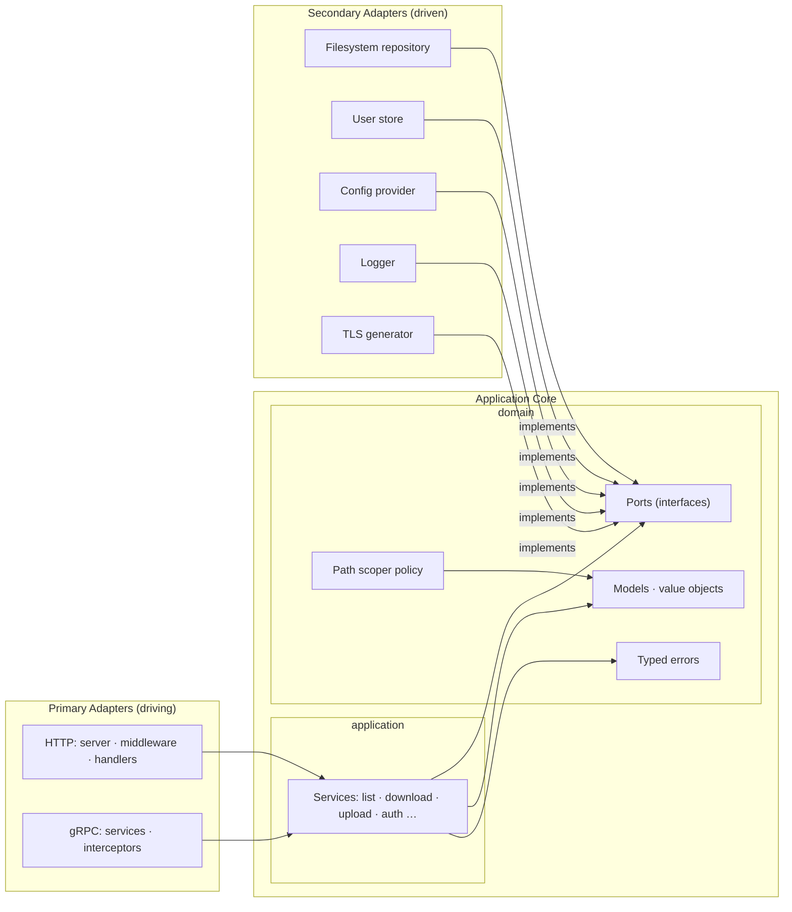
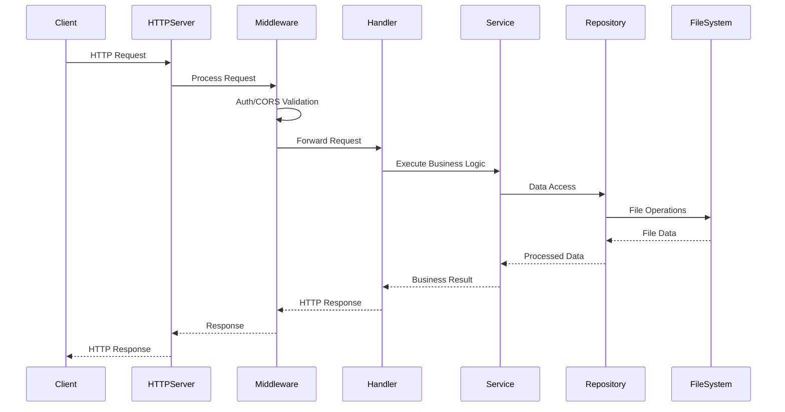
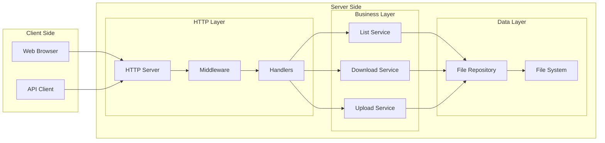

# Simple File Share


A high-performance, secure file sharing application built with Go and React, structured as a hexagonal (ports & adapters) application.

> **Repository split**: this repo is the **backend only** (Go API + gRPC + Docker image). The clients live in sibling repositories, each with its own CI/CD:
> - `frontend` — React + Vite SPA
> - `landing` — Next.js marketing site
> - `mobile` — Flutter app → analyze/test CI

## 🌟 Overview

Simple File Share is a modern web application that provides secure file management capabilities with a clean, intuitive interface. Its backend follows hexagonal architecture: a framework-free domain and application core surrounded by swappable primary adapters (HTTP, gRPC) and secondary adapters (filesystem, auth, config, logging), so storage backends and transports can be replaced independently.

## 🎯 Key Features

### 🛡️ Security First
- **End-to-End HTTPS**: All communications can be encrypted using TLS 1.3
- **Path Traversal Protection**: Built-in safeguards against directory traversal attacks
- **Multi-User Accounts**: Every request is authenticated and scoped to the signed-in user
- **Hashed Passwords**: PBKDF2-SHA256 (600k iterations, per-user salt) — no plaintext credentials
- **Input Validation**: Comprehensive validation for all user inputs
- **CORS Protection**: Configurable CORS policies for web security

### 🚀 Performance Optimized
- **Efficient File Handling**: Stream-based processing for minimal memory usage
- **Concurrent Operations**: Handles multiple file operations efficiently
- **ZIP Streaming**: On-the-fly ZIP creation for folder downloads without temporary files
- **Optimized Timeouts**: Reasonable server timeouts for better resource management

### 📁 Advanced File Operations
- **Directory Browsing**: Clean HTML interface with file details
- **Bulk Operations**: Upload/download multiple files or entire folders
- **Live Upload Progress**: Byte-level progress and transfer rate (KB/s–GB/s) via XHR upload events, aggregated across multi-file batches, with a collapsible floating indicator and cancel + confirmation
- **Broad Format Support**: Documents, images, archives and disk images (incl. `.iso`), video, and audio — matched by MIME type or extension
- **On-Demand Zipping**: Download folders as ZIP archives with a single click
- **File Metadata**: View file sizes, modification dates, and types

### 🖼️ In-App Viewer & Editor
- **File Preview**: Render PDFs, images, audio, and video inline without leaving the page
- **Markdown Editor**: Preview and edit `.md` files with a built-in editor
- **Safe Streaming**: Non-renderable or unsafe types (e.g. HTML/SVG) are force-downloaded

### 🌐 Internationalization
- **Bilingual UI**: English and Arabic with full RTL support
- **Persisted Preference**: Language choice is stored in the browser
- **Auto-detection**: Defaults to Arabic when the browser language is Arabic

### 👥 Multi-User & Permissions
- **Self-Service Signup**: Optional public registration (`ENABLE_SIGNUP`); the first account becomes an admin
- **RBAC**: Built-in `admin`/`member` roles plus custom roles with a permission matrix; gates live in application services
- **Private Storage**: Each regular user sees only their isolated home directory; requests for another user's namespace return `403`
- **Global Shared Folder**: A common `shared/` space that every signed-in user can read (writes are admin-only)
- **Admin Console**: Admins see every account with per-user file count and storage usage
- **Bootstrap Admin**: An admin is seeded from `ADMIN_USERNAME`/`ADMIN_PASSWORD` on first run, so existing deployments keep working

### 🏗️ Hexagonal Architecture
- **Ports & Adapters**: A pure `domain` + `application` core with no framework imports; adapters depend inward, never the reverse
- **Primary Adapters**: HTTP (`net/http`) and gRPC expose the same application services
- **Secondary Adapters**: Filesystem repository, user store, config, TLS, and logging are all swappable behind domain ports
- **Dependency Injection**: Adapters are wired once in `cmd/server/main.go`, keeping the core easy to test
- **Pluggable Storage**: `STORAGE_BACKEND=local` (default) or `s3` swaps the file repository for an S3-compatible object store without touching application code
- **Structured Logging**: Built-in structured logging for monitoring and debugging

## 🛠️ Technology Stack

### Backend
- **Language**: Go 1.25+
- **Transports**: Standard Library `net/http` (web) and gRPC (`google.golang.org/grpc`) for mobile clients
- **Authentication**: HTTP Basic Auth against a JSON-backed user store with PBKDF2-SHA256 password hashing
- **TLS**: Built-in support with automatic certificate management
- **Serving**: Serves the API and the built React frontend from a single container
- **Testing**: Native Go testing with table-driven tests
- **Documentation**: OpenAPI 3.0 (Swagger) specification and a protobuf gRPC contract

### Frontend
- **Framework**: React 19+ with TypeScript
- **Build Tool**: Vite
- **Styling**: Tailwind CSS with responsive design
- **State Management**: Zustand (global stores) with selectors
- **Internationalization**: English/Arabic with RTL layout and persisted preference

### Website
- **Framework**: Next.js App Router with static export (`output: "export"`)
- **Language**: TypeScript
- **Internationalization**: English/Arabic with EN/AR route groups and RTL
- **Deploy**: static export (`output: "export"`) — the `landing` repo's workflow uploads `out/`

### Mobile
- **Framework**: Flutter with Riverpod state management
- **Language**: Dart
- **Transport**: gRPC (`package:grpc`) — JWT via `authorization: Bearer` metadata (token stored in flutter_secure_storage)
- **Features**: Browse/upload/download (resumable), share links with password/expiry/limits, TailTime social feed with follows and per-file privacy, streaming image/video preview, thumbnails, Google sign-in, WebRTC file transfer and voice/video calls, nearby discovery with master switch, username search with presence
- **Config**: `--dart-define=API_BASE_URL=...` sets the API base URL; the gRPC target (host/port/TLS) is derived from it, and can be pointed at a TCP proxy with `--dart-define=GRPC_HOST=... --dart-define=GRPC_PORT=...`. Secure targets fetch the server certificate from `GET /api/grpc/cert` over HTTPS and pin it on the channel. Additional defines: `GOOGLE_SERVER_CLIENT_ID` (Google sign-in), `STUN_URL`/`TURN_URL`/`TURN_USERNAME`/`TURN_CREDENTIAL` (call relay).

## 📚 API Documentation

### Endpoints

#### 1. List Directory
```
GET /api/files?path=<dir>&limit=<n>&cursor=<token>
```
- **Parameters**:
  - `path` (query, optional): Directory path to list (defaults to the user's root)
  - `limit` (query, optional): Page size — default 50, clamped to 1..500
  - `cursor` (query, optional): Opaque `nextCursor` from the previous page
- **Responses**:
  - `200`: Page envelope `{ "items": [ { name, path, size, isDir, modified, mimeType } ], "nextCursor": "…" }` — `nextCursor` is present exactly when more items remain; pass it back verbatim (it is an opaque base64 offset, do not construct one). A malformed cursor is `400 invalid cursor`.
  - `400`: Invalid path or malformed cursor
  - `401`: Authentication required
  - `403`: Forbidden (path traversal or another user's private space)
  - `404`: Path not found
  - `409`: Path is not a directory
  > The same `{"items":[...],"nextCursor":"…"}` envelope (with the same `limit`/`cursor` rules) is used by `GET /api/files/search`, `GET /api/shares`, `GET /api/admin/users`, and `GET /api/admin/roles`. This is a breaking change from the previous bare-array responses.

#### 2. Upload Files
```
POST /api/upload
Content-Type: multipart/form-data
```
- **Parameters**:
  - `file` (form-data): One or more files to upload
  - `path` (form-data, optional): Target directory
- **Responses**:
  - `201`: JSON array of uploaded `{ path, size }` objects
  - `400`: Invalid request
  - `401`: Authentication required
  - `403`: Forbidden (read-only shared folder or another user's space)
  - `413`: Payload too large

#### 3. Download File or Folder
```
GET /api/files/download?path=<path>
```
- Streams the file, or builds a ZIP archive on the fly when `path` points at a directory. The choice is based on the target's actual type, so a regular file named `*.zip` downloads as-is.
- **Revalidation**: file responses carry a strong `ETag` (name + size + mtime) and `Last-Modified`; send `If-None-Match` to get a bodyless `304` instead of the file.
- **Byte ranges**: `Range: bytes=…` on a regular file answers `206` with `Content-Range` (`416` when unsatisfiable), and `If-Range` falls back to the full body when the validator is stale. ZIP archives are synthetic streams and are always sent whole.
- **Responses**:
  - `200`: File or ZIP stream
  - `206`: Partial content (range request on a regular file)
  - `304`: Not modified (validator matched)
  - `400`: Invalid path
  - `401`: Authentication required
  - `403`: Forbidden
  - `404`: Path not found
  - `416`: Requested range not satisfiable

#### 4. View File Inline
```
GET /api/files/view?path=<file>
```
- Streams a file with `Content-Disposition: inline` so the browser renders it.
- Only safe types (PDF, images, audio/video, plain text/markdown) are inline;
  anything else is forced to download to prevent script injection.
- Sends the same `ETag`/`Last-Modified` validators as the download endpoint, so `If-None-Match` revalidates to `304`.
- **Responses**:
  - `200`: File contents
  - `304`: Not modified (validator matched)
  - `400`: Invalid path
  - `401`: Authentication required
  - `404`: Path not found
  - `409`: Path is a directory

#### 5. File Info
```
GET /api/files/info?path=<path>
```
- **Responses**:
  - `200`: `{ name, path, size, isDir, modified, mimeType }`
  - `401`: Authentication required
  - `404`: Path not found

#### 6. Search Files
```
GET /api/files/search?q=<query>&limit=<n>&cursor=<token>
```
- Recursively matches names/paths and full-text content within the caller's visible scope (pure-Go inverted index over text file contents; binaries skipped).
- `limit`/`cursor` follow the shared page envelope described in §1 (default 50 per page).
- **Responses**:
  - `200`: Page envelope `{ "items": [matching file entries], "nextCursor": "…" }`
  - `400`: Missing query or malformed cursor
  - `401`: Authentication required

#### 6b. Live Events (SSE)
```
GET /api/events
Accept: text/event-stream
```
- Server-Sent Events stream of filesystem/account changes for the signed-in user: `upload`, `update`, `mkdir`, `delete`, `share`, `share_revoke`, `restore`, `quota`.
- Frame shape: `data: {"type":"...","path":"...","user":"...","at":"..."}` plus `: ping` heartbeats every 15s.
- Browser clients rely on the HttpOnly `fs_session` cookie (`EventSource` with credentials); API clients may send `Authorization: Bearer <token>`.
- **Responses**:
  - `200`: `text/event-stream` (long-lived)
  - `401`: Authentication required

#### 7. Update File Content
```
PUT /api/files/content
Content-Type: application/json
```
- **Body**:
  ```json
  { "path": "notes.md", "content": "# New content" }
  ```
- Overwrites a plain-text file (used by the markdown editor).
- **Responses**:
  - `200`: `{ "message": "file updated", "size": 21 }`
  - `400`: Invalid request or unknown content type
  - `401`: Authentication required
  - `404`: Path not found

#### 8. Create Directory
```
POST /api/directories
Content-Type: application/json
```
- **Body**: `{ "path": "reports/2026" }`
- **Responses**:
  - `201`: `{ "message": "directory created", "path": "reports/2026" }`
  - `400`: Invalid path
  - `401`: Authentication required
  - `403`: Forbidden (read-only shared folder)
  - `409`: Path already exists

#### 9. Delete File or Folder
```
DELETE /api/files
Content-Type: application/json
```
- **Body**: `{ "path": "old.txt" }`
- **Responses**:
  - `200`: `{ "message": "deleted", "path": "old.txt" }`
  - `400`: Invalid path
  - `401`: Authentication required
  - `403`: Forbidden (read-only shared folder)
  - `404`: Path not found

#### 9b. Share Links (public, with policies)
```
POST /api/shares
Content-Type: application/json
GET  /api/shares?limit=<n>&cursor=<token>   # list caller's links (page envelope, §1)
DELETE /api/shares                    # body: { "token": "..." }
GET  /api/share/{token}               # public fetch, no auth
```
- **Create body**: `{ "path": "report.pdf", "expiresInSeconds": 3600, "password": "open-sesame", "maxDownloads": 5 }`
  - `expiresInSeconds`: `0`/absent = never expires.
  - `password` (max 256 chars): readers must present it; only a PBKDF2 hash is stored and the API never echoes it (`passwordProtected: true` instead).
  - `maxDownloads`: `0`/absent = unlimited; otherwise an atomic budget decremented per successful serve.
- **Reading a protected link**: send the password in the `X-Share-Password` header or the `password` query parameter. The access log records the path only, never the query string.
- **Responses** (public fetch):
  - `200`: File stream (same ETag/Range semantics as §3)
  - `401`: `{"error":"share_password_required"}` or `{"error":"share_password_invalid"}`
  - `404`: Unknown, revoked, or deleted target
  - `410`: Expired link, or `{"error":"share_limit_reached"}` once the budget is spent
- **Create responses**:
  - `201`: Link object with `token`, `passwordProtected`, `maxDownloads`, `downloads`
  - `400`: Validation error (negative `maxDownloads`, oversized password)
- gRPC `CreateShare` now accepts `password` and `max_downloads` fields; passworded/limited links created over HTTP answer `FailedPrecondition`/`ResourceExhausted` over gRPC when the fields are absent.
- Every create/revoke lands in the audit trail (`share.create` with `password,limit` detail flags, `share.revoke`).

#### 9c. Thumbnails (JPEG previews)
```
GET /api/thumbs?path=<file>&w=<width>
```
- Serves a cached, EXIF-stripped JPEG preview of an image the caller owns. Width defaults to 320, clamped to 32–512. Re-encoding drops GPS/metadata by construction.
- **Responses**:
  - `200`: `image/jpeg` bytes
  - `400`: Unsupported format or file too large (>40 MiB)
  - `401`: Authentication required
  - `403`: Cross-user path
  - `404`: File not found
  - `409`: Path is a directory

#### 9d. User Search (username lookup)
```
GET /api/users/search?q=<query>
```
- Case-insensitive substring match on usernames, requester excluded, capped at 20 results. Usernames only — no roles, quotas, or contact details leak.
- **Responses**:
  - `200`: `{ "usernames": ["alice", "bob"] }`
  - `400`: Empty or oversized query
  - `401`: Authentication required

#### 9e. Google Sign-In Exchange
```
POST /api/auth/google/exchange
Content-Type: application/json
```
- **Body**: `{ "idToken": "<Google OIDC ID token>" }`
- Verifies the ID token (RS256 signature against Google's JWK set, issuer, audience against `GOOGLE_CLIENT_ID`, expiry), then mints an app session for the linked account — creating it on first use through the shared OAuth upsert.
- **Responses**:
  - `200`: `{ "accessToken", "tokenType", "expiresIn", "isNewAccount" }`
  - `400`: Invalid/missing token, wrong audience, expired, or Google sign-in not configured
- Public endpoint, rate-limited like login. Audit trail records `login.ok`/`login.fail` with `google` detail.

#### 9f. Social: Follows, Visibility, Feed
```
POST   /api/follows              # body: { "username": "alice" }
DELETE /api/follows              # body: { "username": "alice" }
GET    /api/follows?check=<user> # am I following them?
GET    /api/follows?user=<user>&direction=followers|following
PUT    /api/visibility           # body: { "path", "level": "private|link|public", "allowStream": bool }
GET    /api/visibility?owner=<user>&path=<path>
GET    /api/feed?cursor=<id>&limit=<n>
```
- **Follows**: open-follow edges (one tap, no approval). Both endpoints must be real accounts; self-follow rejected.
- **Visibility**: per-file privacy. `private` = owner only; `link` = followers can see/stream; `public` = any authenticated user. `allowStream` gates media playback for non-owners. Downgrading refreshes all feed entries immediately.
- **Feed**: cursor-paged upload timeline. Owners see their own entries; followers see link-scoped entries from followed users; everyone sees public entries. Metadata only — never raw paths outside the viewer's scope.
- **Responses**:
  - `200`/`201`: Follow/visibility/feed JSON
  - `400`: Validation error
  - `401`: Authentication required
  - `403`: Cross-user visibility set
  - `404`: Unknown user/file
  - `409`: Already following

#### 9g. Shared File Streaming (cross-user)
```
GET /api/shared?owner=<user>&path=<file>
```
- Streams another owner's file after re-checking the streaming gate (link/public + `allowStream`, or owner). Replays the owner's read scope like share resolution. Safe types render inline; anything else is forced to download.
- **Responses**:
  - `200`/`206`: File stream (same ETag/Range semantics as §3)
  - `401`: Authentication required
  - `403`: Gate denied (private, not following, or streaming off)
  - `404`: File not found

#### 10. Health Check
```
GET /health
```
- Liveness: process is up. Used by container health checks and CI smoke tests.
- **Responses**:
  - `200`: Service is healthy
  ```json
  {
    "status": "ok",
    "uptime": "1h0m0s"
  }
  ```

#### 10b. Readiness
```
GET /health/ready
```
- Readiness: dependencies are actually usable (storage root writable, metadata index rebuilt). Every check is reported; any failure yields `503` so orchestrators keep the instance out of rotation.
- **Responses**:
  - `200`:
  ```json
  { "status": "ready", "checks": { "storage": "ok", "index": "ok" } }
  ```
  - `503`: `{"status":"unavailable","checks":{"storage":"error: ..." ,"index":"ok"}}`

#### 10c. Metrics (Prometheus)
```
GET /metrics
```
- Prometheus text exposition (`fileshare_http_*`, `fileshare_grpc_*`, `fileshare_event_streams`, `fileshare_index_files`, …). Enabled by `ENABLE_METRICS` (default on); route-labelled so cardinality stays bounded (patterns, never raw paths — share tokens never appear in labels).
- **Access** (checked in order): `METRICS_TOKEN` bearer (`Authorization: Bearer <token>`, constant-time compare) → when auth is disabled, open (local/system view) → authenticated admin. Anonymous callers get `401`, authenticated non-admins `403`.
- Every response also carries an `X-Request-Id` header (echoed when a well-formed one is supplied, generated otherwise) and the access log lines include `request_id` + `duration_ms` for trace correlation.
- **Profiling**: `ENABLE_PPROF=true` serves `net/http/pprof` on `127.0.0.1:6060` only — never on the public port.

#### 11. Register Account
```
POST /api/auth/register
Content-Type: application/json
```
- **Body**: `{ "username": "alice", "password": "s3cret" }`
- Public endpoint; only available when `ENABLE_SIGNUP` is true. The first account created becomes an admin.
- **Responses**:
  - `201`: `{ "username": "alice", "isAdmin": false, "createdAt": "..." }`
  - `400`: Invalid username or password
  - `403`: Registration disabled
  - `409`: Username already exists

#### 12. Auth Capabilities
```
GET /api/auth/info
```
- Public endpoint reporting runtime auth features.
- **Responses**:
  - `200`: `{ "signupEnabled": true }`

#### 13. Current User
```
GET /api/auth/me
```
- Returns the authenticated account (or the system-admin view when auth is disabled).
- **Responses**:
  - `200`: `{ "username": "alice", "role": "member", "isAdmin": false, "enabled": true, "createdAt": "..." }`
  - `401`: Authentication required

#### 13b. Sessions
```
GET    /api/auth/sessions              # list my active sessions
DELETE /api/auth/sessions/{jti}        # revoke one of my sessions
```
- Every minted token (login, refresh, OAuth, gRPC) is tracked in `.file-share/sessions.json` with issue/expiry, client IP and user agent (50 newest per account).
- Responses use the object pagination shape: `{ "items": [{ "jti", "issuedAt", "expiresAt", "remote", "userAgent", "current" }] }`.
- Revoking a session deny-lists its token immediately; `current: true` marks the session of the presented token.
- **Responses**:
  - `200`: session list / `{ "status": "revoked" }`
  - `401` / `403` / `404`: unauthenticated, someone else's session id, unknown id

#### 13c. Two-factor authentication (TOTP)
```
POST /api/auth/totp/enroll        # start enrollment → { secret, otpauthUri }
POST /api/auth/totp/verify        # confirm a code → { backupCodes: [...] }
POST /api/auth/totp/disable       # turn off (requires a current code or backup code)
```
- Opt-in per account (RFC 6238, SHA-1, 6 digits, ±1 period window). Enrollment starts *pending*: a fresh secret is stored but login is not challenged until `verify` confirms a real code.
- On confirm the server returns **10 single-use backup codes** (`xxxx-xxxx`); only PBKDF2 hashes are stored.
- Once enabled, `POST /api/auth/token` without `otp` answers `401 {"error":"totp_required"}` — resend with `{"username","password","otp"}`. Basic auth has no OTP channel, so enrolled accounts get the same challenge (complete login via the token endpoint). OAuth logins bypass TOTP (the identity provider is the authenticator); gRPC logins on enrolled accounts return `FAILED_PRECONDITION`.
- Backup codes count as valid `otp` values and are consumed on use.
- Administrators can clear a locked-out account via `POST /api/admin/users/{username}/totp/reset`.
- Routes return `404` when `ENABLE_2FA=false`.
- **Responses**:
  - `200`: enrollment material / backup codes / `{ "status": "disabled" }`
  - `400`: invalid or expired code | `401`: `totp_required` | `409`: already enrolled

#### 13d. API keys
```
GET    /api/auth/api-keys          # list my keys (metadata only)
POST   /api/auth/api-keys          # mint: {"name","scope","expiresIn"} → 201 {"key": "sfs_…"}
DELETE /api/auth/api-keys/{id}     # revoke one of my keys
```
- Long-lived credentials for scripts and CI. The full key is `sfs_<16-hex-id>_<32-char secret>` and is shown **once** at mint time — only a PBKDF2 hash is stored (the file alone does not yield usable keys).
- Present it as `Authorization: Bearer sfs_…`. The request runs as the key's owner, narrowed by the key's scope:
  - `read` (default): `GET`/`HEAD`/`OPTIONS`
  - `write`: + mutating methods outside `/api/admin`
  - `admin`: + `/api/admin/*` (role permissions are still enforced, so scope can only *reduce* what the owner may do)
- Keys can verify identity at `GET /api/auth/me` but can never reach password, session, TOTP, or key-management endpoints — a stolen key cannot escalate to account control.
- Optional `expiresIn` (seconds; `0`/absent = never). Last use is recorded at most every 5 minutes. Revocation takes effect immediately.
- Accepting and minting are gated by `ENABLE_API_KEYS` (default on; off hides the routes and rejects every existing key).
- **Responses**:
  - `200`: `{ "items": [...] }` / `{ "status": "revoked" }`
  - `201`: `{ "key", "id", "name", "scope", "prefix" }`
  - `400`: invalid name/scope/expiresIn | `401`: unknown/expired/revoked key | `403`: insufficient scope, blocked endpoint, or unauthenticated | `404`: unknown key id

#### 14. User management (admin / RBAC)
```
GET    /api/admin/users                         # list (users.read)
POST   /api/admin/users                         # create (users.create)
PATCH  /api/admin/users/{username}              # role / enable / rename (users.update)
DELETE /api/admin/users/{username}              # delete + cascade (users.delete)
PUT    /api/admin/users/{username}/quota        # quota.manage
POST   /api/admin/users/{username}/password     # admin reset (users.update)
POST   /api/auth/password                       # change own password
GET    /api/admin/roles                         # roles.manage
POST   /api/admin/roles                         # upsert custom role (roles.manage)
DELETE /api/admin/roles/{name}                  # delete unused custom role (roles.manage)
GET    /api/admin/analytics/overview            # usage rollup (users.read; ?days=1..365)
GET    /api/admin/analytics/timeline            # daily activity buckets (users.read)
GET    /api/admin/analytics/top-files           # most-touched paths (users.read; ?limit=)
GET    /api/admin/audit                         # security audit trail (users.read; ?action=&actor=&limit=&cursor=)
POST   /api/admin/users/{username}/totp/reset   # clear TOTP for a locked-out account (users.update)
```
- Built-in roles: `admin` (all permissions), `member` (no elevated permissions).
- `GET /api/admin/users` and `GET /api/admin/roles` return the shared page envelope (`?limit=&cursor=`, see §1).
- Custom roles store permission grants in `.file-share/roles.json`.
- Disable, rename, role change, and password reset revoke outstanding sessions.
- Analytics events are appended PII-free to `.file-share/events.jsonl` (no IPs or credentials).
- **Audit trail**: `.file-share/audit.jsonl` records `login.ok`/`login.fail`, registrations, admin user/role/quota/password changes, `totp.enroll`/`totp.confirm`/`totp.disable`/`totp.admin_reset`, `apikey.create`/`apikey.revoke`, share create/revoke, and self-service password changes — actor, remote IP, target, and a short detail, never secrets. The query API returns `{"items":[...],"nextCursor":"..."}` (newest first) and rotates on `AUDIT_MAX_BYTES`.
- **Responses**:
  - `200` / `201`: account or role JSON (`role`, `enabled`, `isAdmin`, usage)
  - `400` / `403` / `404` / `409`: validation, forbidden, not found, conflict

#### 15. API Documentation
```
GET /swagger       # Swagger UI
GET /swagger.yaml  # OpenAPI 3.0 spec
```
- **Responses**:
  - `200`: Swagger UI interface or the raw OpenAPI document

### Webhooks (outgoing)

Set `WEBHOOK_URLS` (comma-separated `http(s)` endpoints) to receive signed copies of every application event — `upload`, `update`, `mkdir`, `delete`, `share`, `share_revoke`, `restore`, `quota`, `download`, `login` — without polling the SSE stream.

- **Delivery**: `POST` with a JSON body matching the SSE event shape (`{type, path, user, bytes, at}`), plus headers `X-Webhook-Event: <type>` and `X-Webhook-Signature: sha256=<hex HMAC-SHA256 of the raw body>` when `WEBHOOK_SECRET` is set (verify over the exact bytes received).
- **Semantics**: best-effort and asynchronous — a slow or failing receiver is logged (`webhook delivery failed` / `webhook rejected`) and the event dropped after a 5s timeout; requests that publish events never wait on webhooks, and there are no retries. Four workers with a 64-slot queue bound the fan-out; overflow drops loudly.
- **Disabled by default**: with no `WEBHOOK_URLS` the server starts no dispatcher at all.

### gRPC API (mobile)

The same use cases are exposed over gRPC for native mobile clients. The proto
contract lives at `backend/api/proto/fileshare/v1/fileshare.proto`; generated
Go stubs live beside it (Dart stubs under `mobile/lib/src/grpc/`).

- **Services**
  - `fileshare.v1.AuthService`: `Register`, `Authenticate`, `Me`, `GetAuthInfo`, `ListUsers` (users.read), `Login` (issues JWT), `Logout` (revokes bearer token)
  - `fileshare.v1.FileService`: `ListFiles`, `GetFileInfo`, `SearchFiles`, `CreateDirectory`, `DeletePath`, `UpdateFileContent`, `UploadFile` (client streaming), `DownloadFile` (server streaming)
  - `fileshare.v1.ShareService`: `CreateShare` (with password + max_downloads), `ListShares`, `RevokeShare`
  - `fileshare.v1.EventsService`: `Subscribe` (server streaming of `EventMessage`, per-user filtered)
  - `fileshare.v1.SocialService`: `Follow`, `Unfollow`, `IsFollowing`, `ListFollowers`, `ListFollowing`, `SetVisibility`, `GetVisibility`, `ListFeed`, `DownloadSharedFile` (server streaming)
- **Authentication**: bearer JWT in request metadata (`authorization: Basic ...` or `authorization: Bearer ...`), matching the web API. `Register`, `Authenticate`, `GetAuthInfo`, `Login`, and `Logout` are public.
- **Streaming**: uploads send a metadata message followed by `chunk` messages; downloads stream 256 KiB `DownloadChunk` messages, with the resolved filename/content type on the first chunk; `Subscribe` pushes the same event types as SSE (`upload`, `update`, `mkdir`, `delete`, `share`, `share_revoke`, `visibility`, `follow`, ...).
- **Server**: served on the HTTP port (cleartext HTTP/2 / h2c — what the mobile app uses by default) and on `GRPC_PORT`; health (`grpc.health.v1.Health`) and server reflection are enabled for tooling. `ENABLE_GRPC_TLS` (default: follows `ENABLE_TLS`) turns on TLS for the gRPC listener independently of HTTP, so an edge-terminated deployment can serve plain HTTP while a TCP-proxied `GRPC_PORT` speaks TLS.
- **Configuration**: `ENABLE_GRPC` (default `true`), `GRPC_PORT` (default `50051`), `ENABLE_GRPC_TLS` (default: follows `ENABLE_TLS`).
- **Certificate pinning**: when gRPC TLS is enabled, `GET /api/grpc/cert` returns the PEM certificate the gRPC listener serves (404 when disabled). The self-signed certificate is persisted under `ROOT_DIR/.file-share/tls/` and shared by every listener, so mobile clients can fetch it once over the trusted HTTPS API and pin it — it stays valid across restarts.

```bash
# Inspect the schema (server reflection) with grpcurl
grpcurl -plaintext localhost:50051 list fileshare.v1.FileService
```

## 🏗️ Architecture

### Hexagonal (Ports & Adapters) Layers

Dependencies always point **inward**: adapters know the core, the core knows
only its own ports and models. The `domain` layer imports nothing from
`application` or `infrastructure`.


```mermaid
graph LR
    subgraph PRIMARY["Primary Adapters (driving)"]
        HTTP["HTTP: server · middleware · handlers"]
        GRPC["gRPC: services · interceptors"]
    end

    subgraph CORE["Application Core"]
        subgraph APP["application"]
            SVC["Services: list · download · upload · auth …"]
        end
        subgraph DOMAIN["domain"]
            PORTS["Ports (interfaces)"]
            MODELS["Models · value objects"]
            POLICY["Path scoper policy"]
            ERRORS["Typed errors"]
        end
    end

    subgraph SECONDARY["Secondary Adapters (driven)"]
        FS["Filesystem repository"]
        USERS["User store"]
        CONFIG["Config provider"]
        LOG["Logger"]
        TLS["TLS generator"]
    end

    HTTP --> SVC
    GRPC --> SVC
    SVC --> PORTS
    SVC --> MODELS
    POLICY --> MODELS
    SVC --> ERRORS
    FS -->|implements| PORTS
    USERS -->|implements| PORTS
    CONFIG -->|implements| PORTS
    LOG -->|implements| PORTS
    TLS -->|implements| PORTS
```

### Request Flow


```mermaid
sequenceDiagram
    participant Client
    participant HTTPServer
    participant Middleware
    participant Handler
    participant Service
    participant Repository
    participant FileSystem
    
    Client->>HTTPServer: HTTP Request
    HTTPServer->>Middleware: Process Request
    Middleware->>Middleware: Auth/CORS Validation
    Middleware->>Handler: Forward Request
    Handler->>Service: Execute Business Logic
    Service->>Repository: Data Access
    Repository->>FileSystem: File Operations
    FileSystem-->>Repository: File Data
    Repository-->>Service: Processed Data
    Service-->>Handler: Business Result
    Handler-->>Middleware: HTTP Response
    Middleware-->>HTTPServer: Response
    HTTPServer-->>Client: HTTP Response
```

### Component Interaction


```mermaid
graph LR
    subgraph "Client Side"
        WEB[Web Browser]
        API[API Client]
    end
    
    subgraph "Server Side"
        subgraph "HTTP Layer"
            SERVER[HTTP Server]
            MW[Middleware]
            HANDLER[Handlers]
        end
        
        subgraph "Business Layer"
            LIST[List Service]
            DOWNLOAD[Download Service]
            UPLOAD[Upload Service]
        end
        
        subgraph "Data Layer"
            REPO[File Repository]
            FS[File System]
        end
    end
    
    WEB --> SERVER
    API --> SERVER
    SERVER --> MW
    MW --> HANDLER
    HANDLER --> LIST
    HANDLER --> DOWNLOAD
    HANDLER --> UPLOAD
    LIST --> REPO
    DOWNLOAD --> REPO
    UPLOAD --> REPO
    REPO --> FS
```

### Project Structure

```
.
├── backend/
│   ├── api/                          # Embedded assets
│   │   ├── embed.go                  # Embeds swagger.yaml into the binary
│   │   ├── swagger.yaml              # OpenAPI 3.0 specification
│   │   └── proto/fileshare/v1/       # gRPC contract + generated Go stubs
│   ├── application/services/         # Use-case orchestration (depends on ports only)
│   ├── cmd/server/                   # Composition root: wires adapters, starts HTTP + gRPC
│   ├── domain/                       # Framework-free core
│   │   ├── errors/                   # Typed domain errors
│   │   ├── models/                   # Entities and value objects
│   │   ├── policy/                   # Path scoping / permission rules
│   │   ├── ports/                    # Interfaces implemented by adapters
│   │   └── valueobjects/
│   └── infrastructure/
│       └── adapters/
│           ├── primary/              # Driving adapters: http/, grpc/, authctx/
│           └── secondary/            # Driven adapters: fs/, auth/, config/, tls/, logging/, memory/
├── .github/workflows/
│   ├── ci.yml                        # CI checks: Go backend + Docker image smoke test
│   └── release.yml                   # Image release (GHCR) + Railway deploy
├── Dockerfile                        # Multi-stage build (Go → Alpine runtime, API only)
├── docker-compose.yml
└── makefile                          # Dev targets: run, test, coverage, containers
```

> The `frontend/`, `landing/` (website), and `mobile/` directories moved to
> their own repositories; clone those separately for client work.

## 🚀 Getting Started

### Prerequisites
- Go 1.25 or later
- Node.js 20+ (for frontend development)
- Docker (optional, for containerized deployment)

### Backend Setup

1. **Clone the repository**
   ```bash
   git clone https://github.com/EslamYasser-Dev/simple-file-share.git
   cd simple-file-share/backend
   ```

2. **Install dependencies**
   ```bash
   go mod download
   ```

3. **Configure environment variables**
   ```bash
   export ROOT_DIR=/path/to/storage      # dedicated storage dir (or FILE_SHARE_ROOT)
   export ADMIN_USERNAME=admin           # bootstrap admin (first run only)
   export ADMIN_PASSWORD=securepassword
   export PORT=22010
   export ENABLE_SIGNUP=true             # allow self-service registration
   export APP_ENV=development            # defaults to auth + TLS disabled
   export ENABLE_AUTH=false
   export ENABLE_TLS=false
   ```

   If `ROOT_DIR` is unset in development the server uses a dedicated
   `.file-share-data/` directory next to the working directory. It never falls
   back to the working directory, the source checkout, or the home directory,
   and it rejects unsafe paths at startup.

4. **Run the server**
   ```bash
   go run cmd/server/main.go
   ```

### Frontend / Landing / Mobile setup

The clients are separate repositories (`frontend`, `landing`, `mobile`) — each
has its own README and CI. From a sibling checkout:

```bash
cd ../frontend && yarn install && yarn dev   # Vite dev server
cd ../landing  && yarn install && yarn dev   # Next.js on :3001
cd ../mobile   && flutter pub get && flutter run
```

### Docker Setup

1. **Provide production secrets** — compose requires `JWT_SECRET` and
   `ADMIN_PASSWORD` (the server refuses to start in production without a real
   `JWT_SECRET`). Either export them for the shell:

   ```bash
   export JWT_SECRET="$(openssl rand -hex 32)"
   export ADMIN_PASSWORD='your-strong-password'
   ```

   or put both lines in a `.env` file next to `docker-compose.yml`
   (Docker Compose reads it automatically).

2. **Build and run with Docker Compose**
   ```bash
   docker compose up --build
   ```

### Mobile app (Flutter)

Development moved to the sibling `mobile` repository:

```bash
cd ../mobile
flutter pub get
# Run against your API (defaults: Android emulator 10.0.2.2:3000, iOS/localhost:3000)
flutter run --dart-define=API_BASE_URL=http://10.0.2.2:3000
# static analysis + unit tests (what its CI runs)
flutter analyze && flutter test
```

OAuth sign-in uses the browser session cookie flow. Mobile Google sign-in uses OIDC ID-token exchange (`POST /api/auth/google/exchange`) — set `GOOGLE_CLIENT_ID` on the server and build the app with `--dart-define=GOOGLE_SERVER_CLIENT_ID=<same id>`.

## ☁️ Deployment

Two deployment shapes are supported:

- **API container** — the Docker image from this repository is **backend-only**: it runs the Go API (REST + gRPC) and nothing else. Any Docker-capable host (Railway, Fly.io, Koyeb, Hugging Face Spaces, a VPS…) can run it with one container (fastest: Railway below, then Option A/B).
- **UI on a static host** — the React SPA (`frontend` repo) and the landing site (`landing` repo) deploy to a static host; the browser reaches the API through the `/api/*` rewrite to the Railway origin. A static host cannot run the Go backend (uploads, auth, storage).

### Environment variables

| Variable | Default | Description |
| --- | --- | --- |
| `APP_ENV` | `development` | `production` enables auth; `ENABLE_AUTH`/`ENABLE_TLS` also gate features |
| `PORT` | `22010` (dev `3000`) | HTTP listen port |
| `ROOT_DIR` / `FILE_SHARE_ROOT` | `.file-share-data` (dev) / `/data` (prod) | Dedicated storage directory owned by the server. Created with owner-only permissions (`0700`); unsafe values (filesystem root, working directory, home, source tree, or symlink) are rejected at startup |
| `STATIC_DIR` | `""` (off) | Optional directory of a prebuilt SPA (index.html + assets) to serve from the same origin. Unset in the split deploy — the UI is hosted separately — so the server serves only `/api/*`, `/health`, and the swagger fallback |
| `CORS_ORIGINS` | `""` (same-origin only) | Comma-separated browser origins allowed to call this API cross-origin (e.g. `https://my-ui.example.com`). The request's own host is always allowed; with no value the server sends no `Access-Control-Allow-Origin` to foreign origins, so a separately hosted UI **must** set this |
| `ADMIN_USERNAME` / `FILE_SHARE_USERNAME` | `admin` | Bootstrap admin username, seeded only when no accounts exist |
| `ADMIN_PASSWORD` / `FILE_SHARE_PASSWORD` | `admin` | Bootstrap admin password. In production the server refuses to first-boot seed a known default value (`changeme`, `admin`, …) |
| `JWT_SECRET` | `change-me-in-production` (dev only) | HMAC key for access tokens. **Required in production**: must be a random value of at least 32 characters (e.g. `openssl rand -hex 32`), otherwise the server refuses to start |
| `JWT_TTL_SECONDS` | `3600` | Access-token lifetime in seconds. Non-numeric or non-positive values fall back to the 1-hour default |
| `ENABLE_SIGNUP` | `true` | Allow public self-service registration |
| `MAX_UPLOAD_BYTES` | `unlimited` | Maximum upload size. `unlimited`/`0` (default) caps nothing; set e.g. `2GB`, `500MB`, or a raw byte count to enforce a limit |
| `ENABLE_AUTH` | `true` (prod) / `false` (dev) | Toggle Basic Auth |
| `ENABLE_TLS` | `false` | Serve HTTPS with generated certs |
| `ENABLE_GRPC` | `true` | Toggle the gRPC server for mobile clients |
| `ENABLE_GRPC_TLS` | follows `ENABLE_TLS` | Toggle TLS on the gRPC listener independently of HTTP (for edge-terminated + TCP-proxied deployments) |
| `GRPC_PORT` | `50051` | gRPC listen port |
| `ENABLE_METRICS` | `true` | Serve `GET /metrics` (Prometheus text). Always admin- or `METRICS_TOKEN`-guarded |
| `METRICS_TOKEN` | `""` (off) | Optional static bearer token accepted for `GET /metrics`; admin JWT works regardless |
| `ENABLE_PPROF` | `false` | Serve `net/http/pprof` on a loopback-only side listener (`127.0.0.1:6060`) |
| `ENABLE_SWAGGER` | on outside `production` | `true`/`false` force the Swagger UI and spec on or off; unset serves them unless `APP_ENV=production` |
| `INDEX_SNAPSHOT` | `true` | Persist the full-text index to `ROOT_DIR/.file-share/index.snapshot` (atomic, CRC-checked). Startup then only re-extracts files whose size/mtime changed; corrupt/missing snapshots fall back to a full rebuild automatically |
| `AUDIT_LOG` | `true` | Append security events (logins, admin changes, share lifecycle) to `ROOT_DIR/.file-share/audit.jsonl` and expose `GET /api/admin/audit` |
| `AUDIT_MAX_BYTES` | `8MB` | Rotation size of the active audit file (human sizes accepted) |
| `AUDIT_KEEP` | `3` | Number of rotated audit generations retained (1–10) |
| `ENABLE_2FA` | `true` | Expose the TOTP enrollment/verify/disable routes. Login enforcement follows the account state either way (already-enrolled accounts keep challenging even if the routes are hidden) |
| `ENABLE_API_KEYS` | `true` | Serve the API key endpoints and accept `sfs_…` bearer credentials. `false` hides the routes and stops every existing key from authenticating |
| `OAUTH_GITHUB_CLIENT_ID` / `OAUTH_GITHUB_CLIENT_SECRET` | `""` (off) | Enable GitHub sign-in. Both must be set together, otherwise the provider is never registered |
| `OAUTH_GOOGLE_CLIENT_ID` / `OAUTH_GOOGLE_CLIENT_SECRET` | `""` (off) | Enable Google sign-in. Both must be set together, otherwise the provider is never registered |
| `GOOGLE_CLIENT_ID` | `""` (off) | Comma-separated Google OAuth client IDs accepted as ID-token audience for mobile Google sign-in. Empty disables the exchange endpoint |
| `OAUTH_REDIRECT_BASE` | — | Absolute `http(s)` origin (no path, query, or fragment) that the OAuth callback returns to. **Required in production** whenever OAuth is enabled |
| `OAUTH_SPA_BASE` | API base | Optional origin to hand the browser back to after the OAuth callback instead of the API origin — use it when the SPA is hosted separately |
| `WEBHOOK_URLS` | `""` (off) | Comma-separated `http(s)` endpoints that receive copies of application events (`upload`, `update`, `mkdir`, `delete`, `share`, `share_revoke`, `restore`, `quota`, `download`, `login`). Non-HTTP(S) or malformed entries are dropped at startup |
| `WEBHOOK_SECRET` | `""` (unsigned) | HMAC-SHA256 key for webhook deliveries; payloads carry `X-Webhook-Signature: sha256=<hex>` so receivers can verify integrity |
| `VERSION_KEEP` | `0` (keep all) | Historical snapshots retained per file; oldest are pruned first |
| `STORAGE_BACKEND` | `local` | `local` (filesystem) or `s3` (S3-compatible object store) |
| `S3_ENDPOINT` | AWS regional URL | Custom S3 API endpoint (MinIO, R2, Ceph, GCS). Path-style is forced for non-AWS hosts |
| `S3_BUCKET` | — | Bucket name (required when `STORAGE_BACKEND=s3`) |
| `S3_REGION` | `us-east-1` | Signing region |
| `S3_ACCESS_KEY` / `S3_SECRET_KEY` | — | Credentials (required when `STORAGE_BACKEND=s3`) |
| `S3_PREFIX` | `""` | Optional key prefix inside the bucket (e.g. tenant id) |
| `S3_PATH_STYLE` | auto | `true` forces `endpoint/bucket/key` addressing |
| `API_BASE_URL` | platform default | Mobile app only (`--dart-define`): absolute base URL of the Go API (e.g. `http://10.0.2.2:3000` on Android emulator) |
| `GRPC_HOST` / `GRPC_PORT` | derived from `API_BASE_URL` | Mobile app only (`--dart-define`): override the gRPC target, e.g. a Railway TCP proxy (`GRPC_HOST=shuttle.proxy.rlwy.net GRPC_PORT=<proxy-port>`); TLS still follows the `API_BASE_URL` scheme |

> **Note:** `ADMIN_USERNAME`/`ADMIN_PASSWORD` are preferred over the legacy `USERNAME`/`PASSWORD` names. `USERNAME` is read from the process environment, and on machines where the OS/shell sets a `USERNAME` variable you may get your login name instead — prefer `ADMIN_USERNAME`.

### Railway (API, zero config)

Create a Railway service from this repo — `railway.json` forces the `Dockerfile`
build, health-checks `/health`, and restarts on failure. Set variables **`JWT_SECRET`** (`openssl rand -hex 32`) and
**`ADMIN_PASSWORD`**; leave `ROOT_DIR` unset so the image default `/data` applies
(add a Railway volume mounted at `/data` for persistence; note Railway volumes
are root-owned while the server runs as `nobody`). Railway injects `PORT`,
which the server honors automatically.

**Cross-origin UI:** the image sets no `CORS_ORIGINS`, so the API accepts
same-origin browser calls only. If a separately hosted UI calls this API, set
`CORS_ORIGINS` to its origin (Railway → service → *Variables*), for example
`CORS_ORIGINS=https://my-ui.example.com`.

**Mobile gRPC (TCP proxy):** Railway's edge terminates TLS as HTTP/1.1 toward
the origin, so same-port gRPC does not survive it. Expose gRPC through a raw
TCP proxy instead:

1. Set **`ENABLE_GRPC_TLS=true`** (keep HTTP plain — the edge handles that).
2. Create a TCP proxy for `GRPC_PORT` (50051): Railway dashboard → service →
   *Networking* → *TCP Proxy* (or `railway tcp-proxy create --service <name>`),
   and note the proxy host/port it prints.
3. Build the mobile app with `--dart-define=GRPC_HOST=<proxy-host>
   --dart-define=GRPC_PORT=<proxy-port>`; it pins the certificate from
   `GET /api/grpc/cert` automatically. The certificate lives under
   `ROOT_DIR/.file-share/tls/` and survives redeploys (keep the volume).

### Separately hosted UI + API (split)

The `frontend` and `landing` repositories each carry a static-host config that
rewrites `/api/*` to the Railway origin (currently
`https://shares.up.railway.app`), so the browser reaches this API cross-origin.

### Option A — Any Docker host

```bash
# Build the image (API only)
docker build -t simple-file-share .

# Run it (named volume inherits the image's /data ownership)
docker run -d --name file-share \
  -p 22010:22010 \
  -v file-share-data:/data \
  -e APP_ENV=production \
  -e JWT_SECRET="$(openssl rand -hex 32)" \
  -e ADMIN_USERNAME=admin \
  -e ADMIN_PASSWORD='your-strong-password' \
  simple-file-share

# Or, ready to go (set JWT_SECRET + ADMIN_PASSWORD first, see Docker Setup)
docker compose up --build
```

Then open `http://localhost:22010`.

> **Bind mounts:** if you prefer `-v "$PWD/data:/data"`, the server runs as
> `nobody` (uid/gid 65534) and must own `/data` to lock it to `0700`. Create the
> directory and give it to that user first:
> `mkdir -p data && sudo chown 65534:65534 data`.

### Option B — Pull the published image

Tagging a release (`git tag v1.0.0 && git push origin v1.0.0`) triggers the
release workflow, which builds the image and publishes it to
**GitHub Container Registry** (`ghcr.io/eslamyasser-dev/simple-file-share`).

```bash
docker pull ghcr.io/eslamyasser-dev/simple-file-share:latest
docker run -d --name file-share -p 22010:22010 \
  -v file-share-data:/data \
  -e APP_ENV=production -e JWT_SECRET="$(openssl rand -hex 32)" \
  -e ADMIN_USERNAME=admin -e ADMIN_PASSWORD='your-strong-password' \
  ghcr.io/eslamyasser-dev/simple-file-share:latest
```

### Option C — Local production-mode smoke test

```bash
mkdir -p bin && (cd backend && go build -o ../bin/file-share ./cmd/server)  # builds ./bin/file-share
APP_ENV=production PORT=8090 ROOT_DIR=./data \
JWT_SECRET="$(openssl rand -hex 32)" \
ADMIN_USERNAME=admin ADMIN_PASSWORD='local-smoke-only' ENABLE_TLS=false ./bin/file-share & # or: go run ./backend/cmd/server
# -> http://localhost:8090/health and /api/* (no UI unless STATIC_DIR points at a built SPA)
```

## 🛡️ Security Considerations

- **Dedicated storage**: `ROOT_DIR` is the single directory the server owns. It is created with owner-only permissions (`0700`), and the server refuses to start if it points at a filesystem root, the working directory, the home directory, a source checkout, or a symlink. Uploaded directories are `0700` and files `0600`.
- Always use strong passwords — in production the server refuses to start without a random `JWT_SECRET` (≥32 chars) and will not seed the bootstrap admin with a known default `ADMIN_PASSWORD`
- The API sets security headers on every response (`CSP`, `X-Content-Type-Options`, `X-Frame-Options`, `Referrer-Policy`, `Permissions-Policy`, and `Strict-Transport-Security` over HTTPS)
- Keep TLS certificates up to date
- Disable public signup (`ENABLE_SIGNUP=false`) on private deployments
- Review the user list periodically (`GET /api/admin/users`) and remove stale accounts
- Prefer custom roles with least privilege over granting full `admin` to operators
- Regularly audit file permissions on the `ROOT_DIR` volume
- Monitor access logs for suspicious activity
- Consider adding rate limiting in production
- Validate all user inputs
- Use environment variables for sensitive configuration

## 🧪 Testing

### Backend Tests
```bash
cd backend
go test ./...              # unit + adapter tests
go test -race ./...        # with the race detector (what CI runs)
```

Coverage is enforced in CI with a **40% floor** (override with `COVER_MIN`; generate an HTML report with `make coverage`, which writes `coverage.html`). The suite sits at roughly **54%** today, with the domain policy, auth, gRPC, and handler packages much higher.

### Clients
The clients live in sibling repositories with their own CI:
```bash
cd ../frontend && yarn lint && yarn build   # Vite SPA
cd ../landing  && yarn lint && yarn build   # Next.js static export
cd ../mobile   && flutter analyze && flutter test
```

### Full suite
```bash
make ci     # exactly what GitHub Actions runs (see Make targets below)
```

## 📊 Code Quality

- ✅ **Layered boundaries**: `domain` and `application` contain no framework imports
- ✅ **Typed errors**: Domain errors are mapped to HTTP/gRPC status codes in the adapters
- ✅ **Resource safety**: Upload/download streams are closed via `defer`; ZIPs are built on the fly
- ✅ **Input validation**: Paths are normalized and scoped through the domain policy
- ✅ **CI gates**: module tidiness, `gofmt`, `go vet`, race tests with a 40% coverage floor, and a Docker build + image smoke test

## 🤝 Contributing

Contributions are welcome — open an issue or submit a pull request.

### Development Workflow
1. Fork the repository
2. Create a feature branch
3. Make your changes
4. Add tests
5. Run the test suite (`make ci`) or the Make targets above
6. Submit a pull request

## 🔁 CI/CD

Each repository uses GitHub Actions for continuous integration and delivery.

### This repository (backend)

- **CI Workflow**: `.github/workflows/ci.yml`
  - **Backend** (Go): runs `make ci` from the repository root — module tidiness check, `gofmt`, `go vet`, compile check, race-enabled tests, HTML coverage report, and a 40% coverage floor. The makefile is the single source of truth, so the workflow contains no duplicated shell logic
  - **Docker**: builds the backend-only production image, then smoke-tests it in a fresh container (health check + login) before passing
  - Runs on push to `master`/`main`/`enhancements` and on pull requests

- **Release Workflow**: `.github/workflows/release.yml`
  - Triggers on tags matching `v*.*.*` (e.g., `v1.0.0`) or via manual dispatch
  - Builds the image, smoke-tests it (health, login), and only then pushes to **GitHub Container Registry** (`ghcr.io/eslamyasser-dev/simple-file-share`) with tag/semver/latest tags
  - Creates a GitHub Release with auto-generated release notes
  - **Railway deploy**: runs `railway up --detach` when the `RAILWAY_TOKEN`
    repository secret (Railway → project → tokens) is set; skipped with a
    notice otherwise. To avoid double deploys, turn off Railway's git
    integration if Actions should be the deployer.

### Client repositories

| Repo | CI | Deploy |
| --- | --- | --- |
| `frontend` | `yarn install --immutable`, `tsc`, ESLint, Vite build (`dist/` artifact) | static host (prebuilt `dist/` upload) |
| `landing` | `yarn install --immutable`, ESLint, `tsc`, static export (`out/` artifact) | static host (prebuilt `out/` upload) |
| `mobile` | `flutter pub get`, `flutter analyze`, `flutter test` | — (add a build workflow when store distribution is needed) |

Dependabot is configured in every repository (Go modules / npm / pub /
Docker / GitHub Actions as appropriate).

### Make targets

The makefile is the single source of truth for CI: `.github/workflows/ci.yml`
runs `make ci` verbatim, so a green local run means a green build.

```bash
make help             # list every target with a description
make run              # start the backend with dev defaults (see Environment variables above)
make lint             # fmt-check + vet
make coverage         # tests + HTML report (coverage.html)
make coverage-check   # tests + enforce the COVER_MIN floor (default 40%)
make ci               # exactly what GitHub Actions runs:
                      #   fmt-check, tidy-check, vet, build-check,
                      #   test-race, coverage-html, coverage-floor
```

### How to cut a release

```bash
git tag v1.0.0
git push origin v1.0.0
# The release workflow publishes ghcr.io/eslamyasser-dev/simple-file-share:v1.0.0
# and deploys it to Railway when RAILWAY_TOKEN is configured
```

## 📄 License

Released under the MIT License.

## ✨ What Makes It Unique

1. **Hexagonal Architecture**: A framework-free core with HTTP and gRPC primary adapters sharing the same use cases, and swappable secondary adapters
2. **Minimal Dependencies**: The web server and file operations use Go's standard library; the only third-party modules are gRPC and protobuf for the mobile API
3. **Streaming Architecture**: Handles large files efficiently with minimal memory usage
4. **Production Ready**: Includes health checks, proper error handling, and structured logging
5. **Flexible Storage**: Local filesystem or any S3-compatible object store (AWS, MinIO, R2, GCS) selected via `STORAGE_BACKEND`
6. **Self-Contained**: No database required - perfect for simple deployments
7. **Multi-User**: Per-user private storage, a global shared folder, and an admin console
8. **Input Validation**: Comprehensive validation for security and reliability

## 📞 Support

For support, please open an issue in the GitHub repository.

## 🔮 Roadmap

- [x] **Authentication**: Username/password accounts with PBKDF2 hashing for all API endpoints
- [x] **Multi-User**: Private per-user storage, a read-only shared folder, and an admin console
- [x] **Rate Limiting**: Add rate limiting for API endpoints
- [x] **OAuth2 / SSO**: Drop-in OAuth2 or single-sign-on authentication
- [x] **File Versioning**: Support for file version history
- [x] **Search**: Full-text search capabilities
- [x] **Real-time updates**: Live file/account events over Server-Sent Events
- [x] **User management & RBAC**: Custom roles/permissions, account lifecycle, password reset, session revoke
- [x] **Cloud Storage**: S3-compatible object store (AWS, MinIO, R2, GCS) behind `STORAGE_BACKEND=s3`
- [x] **Mobile App**: Flutter client (browse, upload, download, share, usage, live gRPC events, TailTime social feed, streaming media preview, Google sign-in, WebRTC file transfer and calls, nearby discovery, user search)
- [x] **Analytics**: Usage analytics and reporting (JSONL rollups under `.file-share/events.jsonl`)
- [x] **Observability**: Prometheus `/metrics` (HTTP+gRPC+SSE gauges, admin/token-guarded), `/health/ready` dependency checks, request-id correlation, loopback pprof
- [x] **Fast startup**: CRC-checked full-text index snapshot — boots only re-extract files that changed since the last run
- [x] **Social**: Follow graph, per-file visibility (private/link/public + streaming toggle), upload timeline feed with cursor pagination
- [x] **Calls**: WebRTC voice/video with call-scoped signaling, direct LAN media (host-only ICE), optional TURN relay, transport route detection
- [x] **Thumbnails**: Server-side JPEG previews with EXIF stripping, client-side fallback for older backends
- [x] **Google Sign-In**: OIDC ID-token exchange endpoint with JWK verification
- [x] **Social**: Follow graph, per-file visibility (private/link/public + streaming toggle), upload timeline feed with cursor pagination
- [x] **Calls**: WebRTC voice/video with call-scoped signaling, direct LAN media (host-only ICE), optional TURN relay, transport route detection
- [x] **Thumbnails**: Server-side JPEG previews with EXIF stripping, client-side fallback for older backends
- [x] **Google Sign-In**: OIDC ID-token exchange endpoint with JWK verification

## 📈 Performance Notes

Rather than published benchmarks, the design keeps resource usage predictable:

- Uploads are written as a stream, so memory stays flat regardless of file size
- Downloads stream directly from disk; folder downloads are zipped on the fly
- The gRPC API streams uploads and downloads in 256 KiB chunks
- Storage indexing is in-memory, so listing is fast; the startup stat walk always runs, but with `INDEX_SNAPSHOT` on (default) only files whose size/mtime changed are re-read for the full-text index — unchanged documents are restored from a CRC-checked snapshot
- No external database, cache, or message broker to operate
- Observability is dependency-free: a hand-rolled Prometheus registry (`/metrics`), route-pattern labels (bounded cardinality), request-id correlation on every response, and loopback-only pprof

---

**Built with ❤️ using Go and React**
